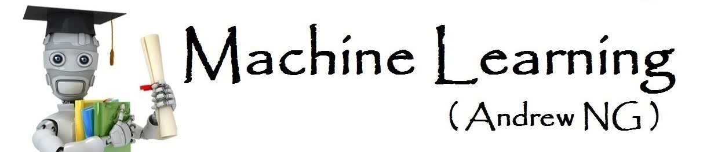

# Machine Learning Coursera - 2018
This is the old version of the Coursera Machine Learning Specialization (Andrew Ng).
Previously, instead of being organized into three courses like now, it was distributed over 10 weeks.
All the coding was in MatLab, now it is in Python.

